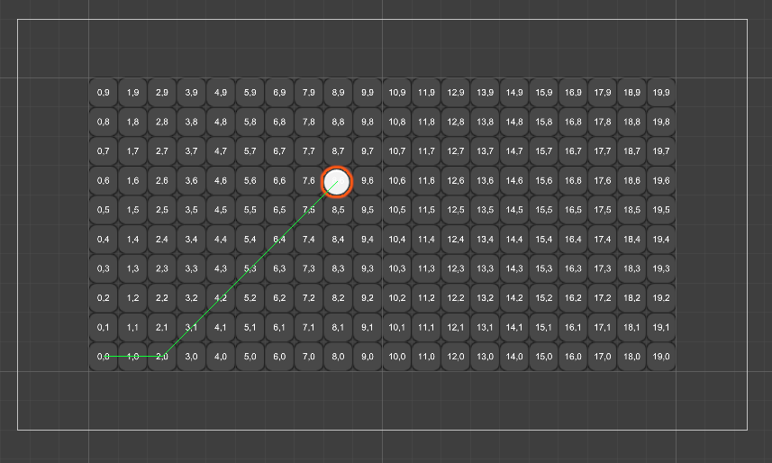

# Pathfinding Tool using A* Algorithm

## Overview

This Unity project demonstrates a pathfinding tool utilizing the A* algorithm, implemented in C#. The tool is designed to efficiently find the shortest path between two points on a grid, making it suitable for various game development applications.




## Features

- **A* Algorithm**: Utilizes the A* algorithm to find the optimal path between start and end points.
- **Unity Integration**: Fully integrated with Unity, allowing easy customization and extension.
- **Customizable Grid**: The grid system can be adjusted to fit different scenarios and map sizes.
- **Obstacle Handling**: Supports obstacles on the grid, ensuring that the pathfinding avoids them.

## Requirements

- **Unity**: Version 2020.3 or later
- **C#**: Basic understanding of C# scripting

## How to Use

1. Clone this repository to your local machine.
   ```bash
   git clone https://github.com/nimisha-korat/pathfinding-tool.git
